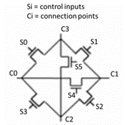

# VLSI systems: Switch Box for FPGAs

### 1. Introduction

The purpose of this project is to describe the process of analog design of an electrical circuit, consisting of CMOS, with the help of the **Cadence Virtuoso** tool.

We were requested the design of a **switch box** used by an **FPGA**. FPGA or Field Programmable Gate Array is a general purpose integrated circuit consisting of a number of logic gates and other systems used to handle digital operations. An FPGA is placed in a circuit and then programmed to combine suitable gates and other standard circuits to operate the functions of the circuit. Switch boxes are circuits contained in an FPGA and their role is to be able to connect the various subsystems to each other depending on the control signals they receive.

The following is an illustrated circuit of a switch box consisting of 6 transistors:

    

The various connections of the subsystems - subcircuits are made in **Ci** while the **control signals are applied in Si**, thus they influence the states of the respective transistors in order to connect and disconnect the systems that are connected at their pins (drain, source).

This report presents the **schematic design of the circuit at the transistor level (schematic)** and the corresponding **physical layout**. In addition, various difficulties and questions that arose during the design process are described and an analysis is presented which verify the operation of a switch box.

### 2. Schematic design of the circuit at the transistor level

In the first part of the work the design at transistor level was requested. The design was done with the help of the Cadence program and the *gpdk045 library*. 6 **nMOS** transistors of 45nm technology and width (W) 120nm were used to create the circuit.

The circuit that designed is shown below:

    

The figure shows that the substrates (Bulk) of the transistors are driven to ground, which is unusual as most of the time the substrate is connected to the source. It generally applies that in a transistor the substrate voltage V_B must not be higher than the voltages of the source V_S, drain V_D. NMOS are symmetric layouts, but usually the lowest potential is at the source and so it is common to connect source to bulk so that V_S = V_B, thus ensuring that the potential of the substrate does not exceed the potential of either the source or the drain. However, in the circuit that was asked to be designed, it does not always happen that the voltage at the source is less than the voltage at the drain, but which pin has the lowest voltage at each transistor depends on Ci and which transistors conduct or not. So to ensure that the substrate potential will always be at a lower potential from both the drain and the source, it is connected to ground so that V_B = 0.

It is further observed that **Ci is represented by Input / Output pins**, while **Si is represented by Input pins**. The Ci connects the subsystems of an FPGA, which either receive or transmit a signal, while the Si are the input pins.

After the transistor level design was completed, the following symbol was created, a *shortcut* to the circuit described above, used to perform the following analysis:

    

### 3. Analysis

In order to prove the robust functionality of our design, 3 analyzes were performed. As mentioned, the role of the switch box in an FPGA is to connect different subsystems to each other depending on the control signals it receives. In this particular switch box there are four Ci and therefore six Si (as many as transistors), thus allowing the connection of a device to a maximum of three other devices. The following analyzes show the connections made between a Ci and the rest. It is noted that this switch box can make 12 connections, in particular 6 two-way connections. In the following analyzes only the 6 connections are checked. The results also apply to their bidirections.

#### 3.1. Analysis 1
Here the signal transfer from C0 to C1, C2 and C3 is observed by generating control signals to S0, S3 and S4. The circuit that was designed is the following:

    

We are connecting C0 with a 1V power source and C1, C2, C3 with Output Pins to record the output. To display output at C3, C1, C2, appropriate signals must be given to S0, S4, S3 respectively. Thus we connect S0, S4, S3 to sources that give desired pulses of 1V and S1, S2, S5 to ground.

The resulting waveforms are:

    

As it seems when the appropriate transistors start to conduct C3, C1, C2 follow the waveform of C0. There is of course a voltage drop but it is negligible. This voltage drop is due to the fact that in order for an nMOS to conduct current V_GS> V_TH. Initially the condition is true and current is transferred to the source, but this results in an increase in V_S and therefore a decrease in V_GS. Thus we reach a *point of equilibrium* so that the transistor conducts but at its output is a ‘poor’ logic 1.

#### 3.2. Analysis 2
At this point, the connections of C1 are examined only with C2, C3, as the connection C1-C0 is the bidirectional of C0-C1 and was examined in the previous analysis. The circuit for the analysis and the results are similar to those of the 1st analysis and are presented below:

    

Here it is worth to mention that there is an increase in voltage at C0, but this voltage is a negligible of ~ 1.5mV.

    

#### 3.3. Analysis 3
In the final analysis the C2-C3 connection is examined as the other connections that C2 can make were examined as bidirectionals.

    

    

At this point and after a change in the control signal S5, the following waveforms are produced which bring out that after the disconnection the C3 is still in the form that C2 had when the interruption took place, there is of course a voltage drop but it is negligible.

    

### 4. Layout - Physical Design
The last stage of the work was the creation of the physical design, that is, the real form of the circuit and its materials. *Metal 1* material was used for the connections between the sources and outputs of the transistors. The transistor gates were connected to the *Poly* material, which was then changed to Metal 1 via *Via*, to be connected to the Si control inputs. To avoid the contact of two Metal 1 cables with each other, Via was used to change to *Metal 2*. Finally, the substrates had to be connected to ground and the red square from Metal 2 shown below was used.  (incorrectly, as it does not make contact with any other element)

    

### Authors

* [Dimitrios-Marios Exarhou](https://github.com/exarchou) 

* [Christos Emmanouil](https://github.com/eachristgr) 
